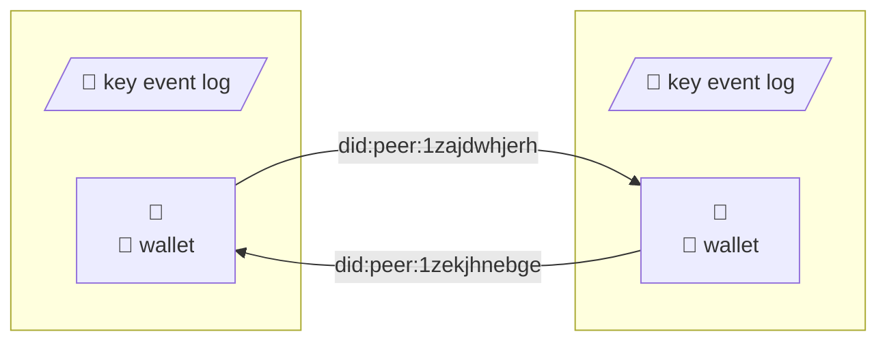
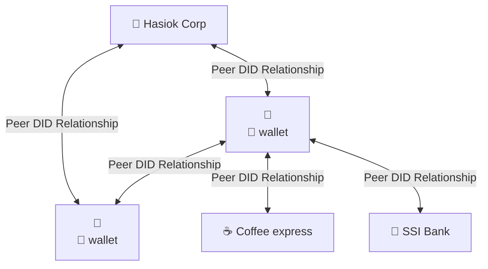
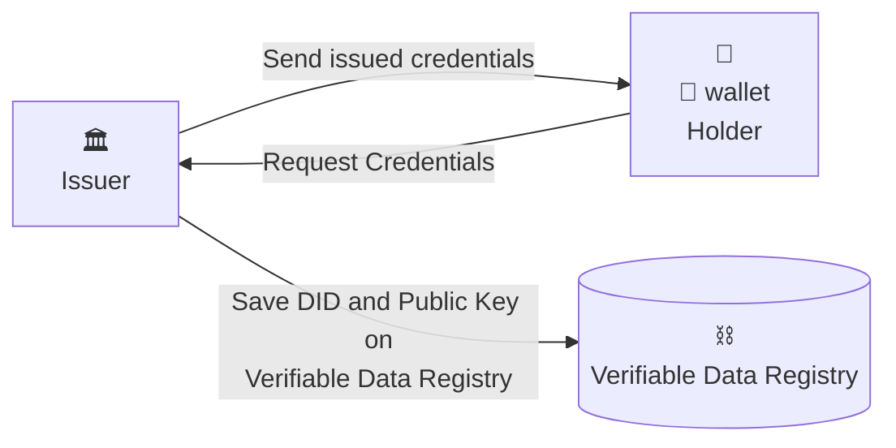
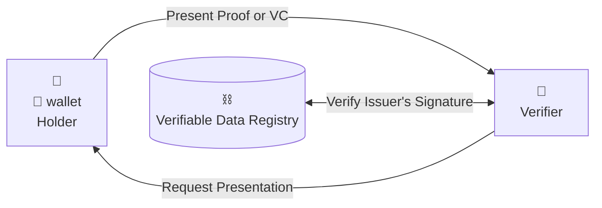
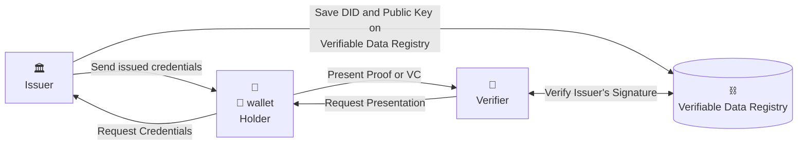

# Self-sovereign identity

---

# Digital identity

All of (digitized) information that exists about you:

<v-clicks>

<div class="no-dots">

- core attributes
- health data
- education/work history
- financial information

</div>

</v-clicks>

---
layout: section
---

# Digital Identity models

---

# Evolution of digital identity


---

# Centralized identity model

The identity is established by registering an account (providing username and password).


---

# Federated identity model

The identity to end orgs (called relying parties - RP) is provided by Identity Provider (IDP), which is a single source of user credentials.


---

# Decentralized identity model

The identity is provided directly by peers that share a connection. Neither of peer “provides”, “controls”, or “owns” the relationship with the other.


---

# What is Self-sovereign identity (SSI)?

Self-Sovereign Identity (SSI) is a user-centric approach to digital identity that gives people and organizations full control over their data

<!--
- Individuals with self-sovereign identity can store their data to their devices
- and provide it for verification and transactions
- without the need to rely upon a central repository of data.
- With self-sovereign identity, users have complete control over how their personal information is kept and used.
-->

---
title: In other words
---

In other words...

<v-clicks>

<div class="no-dots">

- SSI enables "Bring you own identity" model.

</div>

</v-clicks>

---
layout: section
---

# Let's meet Paweł

<!--
- SSI vs. real world
-->

---

# Paweł wants to have a comunicator without any kind of server

In order to do that, Paweł needs:

<v-clicks>

- Decentralized ID (DID)
- DID document
- Wallet
- DIDComm protocol

</v-clicks>

---

# Decentralized Identifier (DID)

A globally unique identifier that does not require a centralized registration authority because it is registered with distributed ledger technology or other form of decentralized network.

---

# DID model


---

# DID method exaples


---

# DID core properties


---

# DID document

```json
{
  "@context": "https://www.w3.org/ns/did/v1",
  "id": "did:example:123456789abcdefghi",
  "authentication": [{
    "id": "did:example:123456789abcdefghi#keys-1",
    "type": "Ed25519VerificationKey2018",
    "controller": "did:example:123456789abcdefghi",
    "publicKeyBase58" : "H3C2AVvLMv6gmMNam3uVAjZpfkcJCwDwnZn6z3wXmqPV"
  }],
  "service": [{
    "id":"did:example:123456789abcdefghi#vcs",
    "type": "VerifiableCredentialService",
    "serviceEndpoint": "https://example.com/vc/"
  }]
}
```

---

# DID ecosystem


---

# Digital wallet

Encrypted database that stores credentials, keys and other secrets.

---

# DIDComm



---

# DIDComm



---
layout: section
---

# Paweł receives an e-identity

---

# Verifable Credentials (VCs)

<dl>
  <dt>Claim</dt>
  <dd>An assertion made about a subject.</dd>
  <dt>Credential</dt>
  <dd>A set of one or more claims made by the issuer.</dd>
  <dt>Verifiable credential</dt>
  <dd>Credential that is tamper-evident and that has authorship that can be cryptographically verified.</dd>
</dl>

---

# Physical to digital credential transformation


<!--
Mention about ZKP-based credentials.
-->

---

# Issuing credentials



---
layout: section
---

# Paweł goes to ssi-Bank

---

# Trust triangle

Describes relationship between the issuer, holder and verifier - it also conveys human relationship in the digital world.

---

# Trust triangle


---

# Verifying credentials



---

# Selective disclosure

Reveal minimum set of information what is necessary to execute a transaction

---
title: Selective disclosure (diagram)
---


---

# Verifable credentials flow



---
layout: section
---

# Paweł goes shopping in Brasil

---

# SSI governance frameworks

Set of business, legal and technical rules and policies that issuer must follow to issue a credential.

<!--
The entity that creates and administers a governance framework is known as the "governance authority".
-->

---

# SSI governance frameworks


---
title: SSI governance framework example
---


---
layout: section
---

# Paweł doesn't trust Chinese wallets

---

# Trust over IP (ToIP) stack

A four-layer architectural model for SSI-powered digital trust infrastructure.

---

# ToIP stack


---
layout: section
---

# Paweł wants to buy a drink

---

# Zero-knowledge proof (ZKP)

<dl>
  <dt>Completeness</dt>
  <dd>If the statement is really true and both users follow the rules properly, then the verifier would be convinced without any artificial help.</dd>
  <dt>Soudness</dt>
  <dd>In case of the statement being false, the verifier would not be convinced in any scenario, except with some small probability.</dd>
  <dt>Zero-Knowledge</dt>
  <dd>The verifier in every case would not know any more information.</dd>
</dl>

---
layout: section
---

# Age verification

---

# Setup

- Paweł receive from Trent secret seed (S), with known model (e.g. first half of seed contains only "0")
- Trent calculate encrypted age: $\mathrm{EncryptedAge} = \mathrm{encrypt}\left(\mathit{HASH}^{\mathrm{ActualAge}+1}(S)\right)$

---

# Construction

- Paweł calculate proof: $\mathrm{Proof} = \mathit{HASH}^{1+\mathrm{ActualAge}-\mathrm{AgeToProve}}(S)$
- If Paweł is 22 year old and want to prove, that he is older than 18, he calculate $\mathrm{Proof} = \mathit{HASH}^{5}(S)$
- Paweł sends Victor EncryptedAge and Proof

---

# Verification

- Victor verifies EncryptedAge signature and decrypt it using Trent's public key
- Victor calculates verified age: $\mathrm{VerifiedAge} = \mathit{HASH}^{\mathrm{AgeToProve}}(\mathrm{Proof})$
- Victor checks if EncryptedAge = VerifiedAge

---
title: Age verification (diagram)
---


---
layout: section
---

# Thank you!

---

# Sources

- "Self-Sovereign Identity" by Alex Preukschat and Drummond Reed, Manning Publication
- <a href="https://www.w3.org/TR/vc-data-model/" target="_blank">Verifiable Credentials Data Model 1.0</a>
- <a href="https://www.citi.com/ventures/perspectives/opinion/digital-identity.html" target="_blank">Citi Ventures</a>
- <a href="https://www.stratumn.com/en/blog/zero-knowledge-proof-of-age-using-hash-chains" target="_blank">Zero-knowledge proof using hash chains</a>
- <a href="https://walt.id/white-paper/self-sovereign-identity-ssi" target="_blank">Introduction to Self-Sovereign Identity</a>
